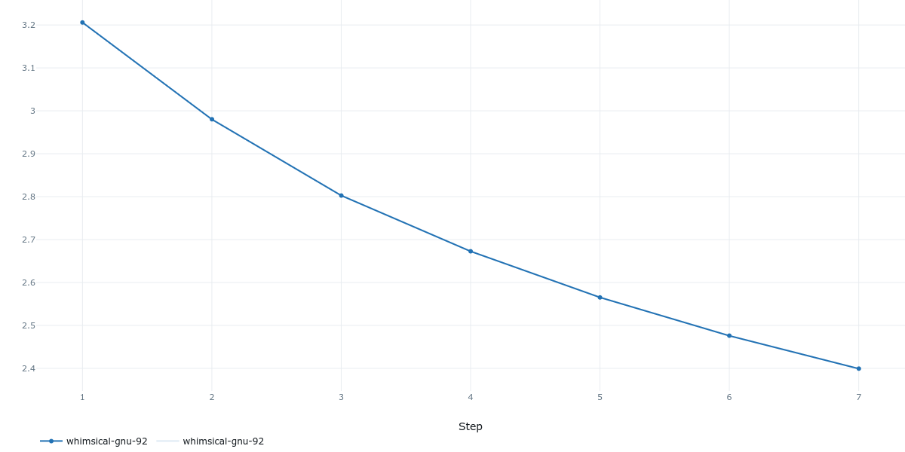
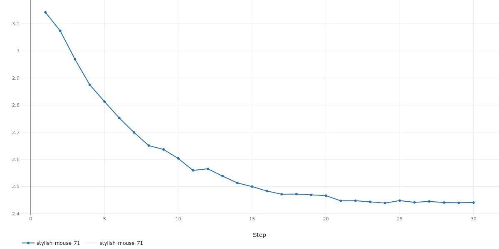
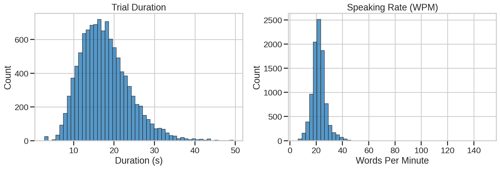
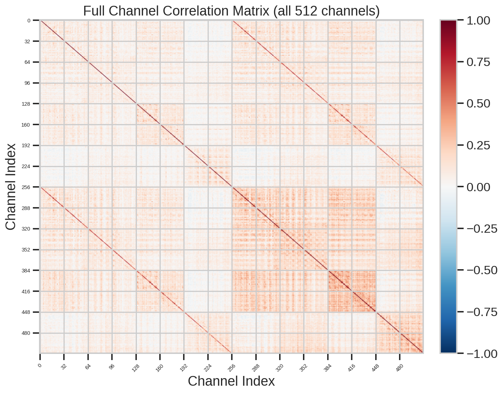
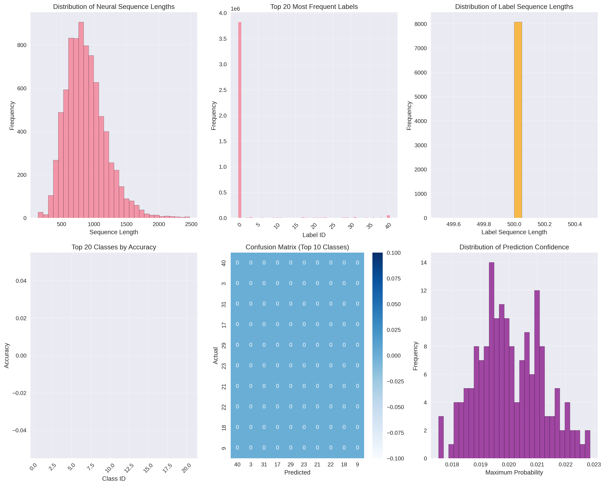
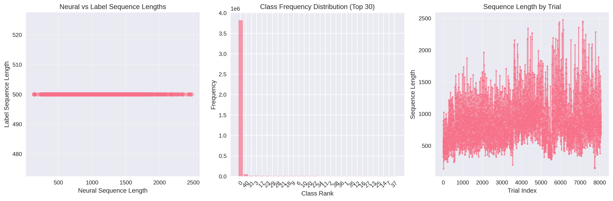

# 🧠 Brain-to-Text 2025

> A Kaggle competition solution for decoding neural signals directly into text using a flexible architecture supporting both Transformer and Bi-Directional LSTM models.

---

## 🏆 About the Competition

**[Brain-to-Text 2025](https://www.kaggle.com/competitions/brain-to-text-25/overview)** challenges participants to decode intracortical neural recordings from a paralysed participant into natural language text in real time.

This competition represents a landmark step in **Brain-Computer Interface (BCI)** research. By bridging the gap between neural activity and language, it has the potential to restore communication for millions of people living with ALS, locked-in syndrome, and other motor-neuron disorders. The winning solutions could directly inform clinical-grade speech neuroprosthetics — making this one of the most socially impactful machine-learning competitions of the decade.

---

## 🗂️ Project Structure

```
Brain-to-Text/
├── config.py          # All hyper-parameters & path configuration
├── dataset.py         # BrainDataset (multi-file HDF5) + collate_fn
├── model.py           # PositionalEncoding + BrainTransformer
├── trainer.py         # train_epoch / validate / checkpoint / submission
├── main.py            # End-to-end training pipeline entry point
├── assets/            # Training curve plots
└── requirements.txt   # Python dependencies
```

---

## 🤖 Model Architectures

This project supports seamlessly switching between two distinct network backbones to map multi-electrode neural spike features to character-class logits:

1. **Transformer Encoder (`BrainTransformer`)**: Uses multi-head self-attention, feed-forward layers, and sinusoidal positional encoding.
2. **Bi-Directional LSTM (`BrainLSTM`)**: A recurrent neural network sequence modeling alternative employing bidirectional processing.

Switch the architecture by setting `model_type` to `"Transformer"` or `"LSTM"` in `config.py`.

**Transformer View:**

```
Input (B, T, 512)
    │
    ▼
Linear Projection  →  (B, T, d_model)
    │
    ▼
Sinusoidal Positional Encoding
    │
    ▼
TransformerEncoder  ×  num_layers
  [MultiHeadAttention + FFN + LayerNorm]
    │
    ▼
Linear Head  →  (B, T, vocab_size)
```

| Hyper-parameter   | Default |
|-------------------|---------|
| `input_size`      | 512     |
| `d_model`         | 512     |
| `nhead`           | 8       |
| `num_layers`      | 4       |
| `dim_feedforward` | 1024    |
| `dropout`         | 0.2     |
| `vocab_size`      | 500     |

**LSTM specific Hyper-parameters:**
| Hyper-parameter       | Default |
|-----------------------|---------|
| `lstm_hidden_size`    | 512     |
| `lstm_num_layers`     | 3       |
| `lstm_dropout`        | 0.3     |
| `lstm_bidirectional`  | True    |

---

## ⚙️ Configuration (`config.py`)

All paths and hyper-parameters live in a single `Config` class — no magic strings scattered across files.

```python
class Config:
    # Data
    DATA_DIR      = "/path/to/hdf5_data_final"
    SESSION_GLOB  = "t15.*"          # matches every session folder
    TRAIN_FILENAME = "data_train.hdf5"
    VAL_FILENAME   = "data_val.hdf5"
    TEST_FILENAME  = "data_test.hdf5"

    # Model Selection
    model_type = "LSTM"              # "LSTM" or "Transformer"
    input_size = 512
    # Transformer: d_model = 512 ; nhead = 8 ...
    # LSTM: lstm_hidden_size = 512 ; lstm_num_layers = 3 ...

    # MLFlow
    MLFLOW_TRACKING_URI    = "http://127.0.0.1:5000"
    MLFLOW_EXPERIMENT_NAME = "brain-to-text-transformer"
    MLFLOW_MODEL_NAME      = "BrainTransformer"
```

At runtime, `main.py` automatically discovers **all session folders** matching `SESSION_GLOB` — simply drop a new `t15.YYYY.MM.DD/` directory into `DATA_DIR` and it will be picked up without any code changes.

---

## 🧬 Data Augmentation

To reduce overfitting and improve model robustness, `BrainDataset` implements a multi-stage augmentation pipeline for training:

1.  **Time Masking (SpecAugment-style)**: Randomly masks 1-2 time blocks (length 5-20) with 0s (40% prob).
2.  **Channel Dropout**: Randomly sets 15% of electrode channels to zero (25% prob).
3.  **Gaussian Noise**: Adds additive noise (`torch.randn_like * 0.04`) to input features (30% prob).
4.  **Time Sub-sampling**: Randomly stretches or compresses the time dimension by ±10% (20% prob).

These augmentations are only applied when `augment=True` and are automatically bypassed during validation or inference (`is_test=True`).

---

## 📊 MLFlow Experiment Tracking

All training runs are tracked with **[MLFlow](https://mlflow.org/)**, giving you a full audit trail for every experiment.

**Logged parameters** (every run):
`input_size`, `d_model`, `nhead`, `num_layers`, `dim_feedforward`, `dropout`,
`batch_size`, `learning_rate`, `num_epochs`, `grad_clip`, `vocab_size`, `optimizer`, `scheduler`, …

**Logged metrics** (every epoch):
`train/loss`, `val/loss`, `val/accuracy`, `lr`, `best_val_loss`

**Model Registry:**
The best checkpoint is automatically registered in the MLFlow Model Registry under `BrainTransformer`, making it straightforward to promote a run to *Staging* or *Production* and serve it via `mlflow models serve`.

```bash
# Start the tracking server
mlflow server --host 127.0.0.1 --port 5000

# Launch training
python main.py

# Serve the registered model (Production stage)
mlflow models serve -m "models:/BrainTransformer/Production" -p 8080
```

---

## 📈 Training Results

| Metric | Curve |
|--------|-------|
| Train Loss |  |
| Validation Loss |  |

---

## 🔎 Exploratory Data Analysis & Visualizations

We provide two dedicated scripts for dataset exploration and model diagnostics, producing rich visualizations under `eda_plots/` and `visualizations/`.

### 1. Dataset EDA (`eda.py`)
Focuses on the macroscopic and statistical properties of the raw neural datasets (Train, Val, Test) across all recording sessions **before** model training:
- **Corpus & Sentences**: Distributions of sentence words, speaking rate (WPM), and trial duration.
- **Channel Correlation**: Generates full and Spike-Band-Power (SBP) channel-correlation heatmaps to ensure raw signal integrity.
- **Diagnostics**: Missing values, sequence alignment, and memory usage tracking.

*Example EDA plots:*
> 
> 


### 2. Model Diagnostics (`visualization_transformer.py` & `visualization_LSTM.py`)
Evaluates how well your chosen model has learned from the data by doing forward passes on the latest saved checkpoint. Please run the corresponding script related to your active `config.model_type`:
- **Prediction Diagnostics**: Calculates per-class precise Accuracy metrics and Top-20 ranking.
- **Class Confusion**: Renders detailed Confusion Matrices for the top most-confused phonemes.
- **Confidence Levels**: Plots the Softmax prediction confidence spectrum.
- **Model Capacity Analysis**: Analyzes neural sequence-to-label length ratios vs model parameters capability.

*Example Visualization outputs:*
> 
> 

---

## 🚀 Quick Start

```bash
# 1. Install dependencies
pip install -r requirements.txt

# 2. Edit config.py – set DATA_DIR to your HDF5 root
#    DATA_DIR = "/your/path/hdf5_data_final"

# 3. Start MLFlow tracking server (separate terminal)
mlflow server --host 127.0.0.1 --port 5000

# 4. Train
python main.py

# 5. View results in browser
open http://127.0.0.1:5000
```

---

## 📋 Requirements

See [`requirements.txt`](requirements.txt) for the full dependency list.

---

## 📄 License

This project is for research and competition purposes only.