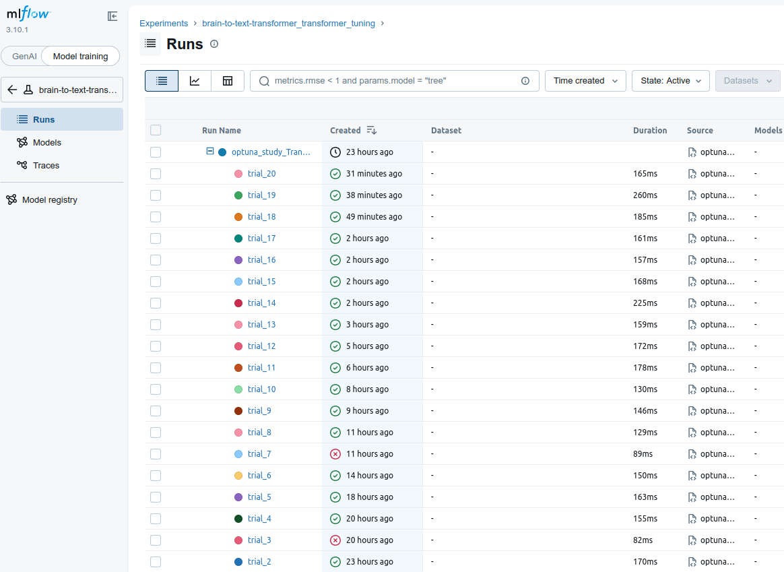
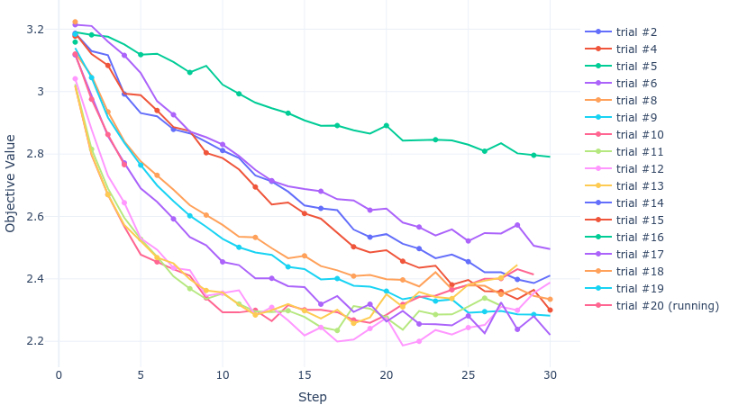

# 🧠 Brain-to-Text 2025

[English Version](./README.md)

> 一个 Kaggle 竞赛解决方案，利用支持 Transformer 和 双向 LSTM 模型的灵活架构，将神经信号直接解码为文本。

---

## 🏆 关于竞赛

**[Brain-to-Text 2025](https://www.kaggle.com/competitions/brain-to-text-25/overview)** 挑战参赛者实时解码瘫痪受试者的皮层内神经记录，并将其转化为自然语言文本。

这项竞赛代表了 **脑机接口 (BCI)** 研究的里程碑。通过桥接神经活动与语言，它有潜力为数百万患有渐冻症（ALS）、闭锁综合征和其他运动神经元疾病的人恢复沟通能力。获胜方案可能直接为临床级语音神经义肢提供参考。

---

## 🗂️ 项目结构

```
Brain-to-Text/
├── config.py          # 所有超参数和路径配置
├── dataset.py         # BrainDataset (多文件 HDF5) + collate_fn
├── model.py           # 位置编码 + BrainTransformer / BrainLSTM
├── trainer.py         # 训练 / 验证 / 检查点 / 提交生成
├── main.py            # 端到端训练管道入口
├── optuna_tune.py     # 自动超参数调优 (Optuna + MLFlow)
├── assets/            # 训练曲线图与 UI 截图
└── requirements.txt   # Python 依赖项
```

---

## 🤖 模型架构

该项目支持在两种不同的网络骨干之间无缝切换，将多电极神经脉冲特征映射到字符类别的 logits：

1. **Transformer Encoder (`BrainTransformer`)**: 使用多头自注意力机制、前馈层和正弦位置编码。
2. **双向 LSTM (`BrainLSTM`)**: 另一种循环神经网络序列建模方式，采用双向处理。

在 `config.py` 中将 `model_type` 设置为 `"Transformer"` 或 `"LSTM"` 即可切换架构。

---

## ⚙️ 配置 (`config.py`)

所有路径和超参数都集中在单个 `Config` 类中。

在运行时，`main.py` 会自动发现所有匹配 `SESSION_GLOB` 的会话文件夹。只需将新的 `t15.YYYY.MM.DD/` 目录放入 `DATA_DIR`，它就会被自动加载，无需更改代码。

---

## 🧬 数据增强

为了减少过拟合，`BrainDataset` 为训练实现了多阶段增强管道：

1.  **时间遮掩 (Time Masking)**: 随机遮掩 1-2 个时间轴块（长度 5-20）。
2.  **通道丢弃 (Channel Dropout)**: 随机将 10% 的电极通道置零。
3.  **高斯噪声 (Gaussian Noise)**: 添加加性噪声。
4.  **时间子采样 (Time Sub-sampling)**: 随机拉伸或压缩时间维度 ±10%。

这些增强仅在 `augment=True` 时应用，在验证或推理时会自动跳过。

---

## 📊 MLFlow 实验跟踪

所有训练运行都通过 **[MLFlow](https://mlflow.org/)** 进行跟踪。

你可以请在浏览器中直接访问 **[http://localhost:5000](http://localhost:5000)** 来查看 MLFlow UI，其中包含了训练的详细信息：

> 
> *这是 MLFlow UI 中展示的实验列表，记录了每次运行的参数与指标。*

**记录的指标** (每轮 epoch):
`train/loss`, `val/loss`, `val/accuracy`, `lr`, `best_val_loss`

**模型注册 (Model Registry):**
最佳检查点会自动注册，方便进行版本控制。

```bash
# 启动追踪服务器
mlflow server --host 127.0.0.1 --port 5000
```

---

## 🎯 自动超参数调优 (`optuna_tune.py`)

使用 **[Optuna](https://optuna.org/)** 自动搜索最优超参数。

- **自动剪枝 (Automatic Pruning)**: 提前停止表现不佳的实验以节省时间。
- **独立追踪**: 每个 trial 都在 MLFlow 中作为一个独立的 Run 记录。

```bash
# 调优 Transformer
python optuna_tune.py --model Transformer --trials 50
```

在调优开始后，你可以启动 **optuna-dashboard** 并在浏览器中访问 **[http://127.0.0.1:8080](http://127.0.0.1:8080)** 来实时可视化调参过程：
```bash
# 启动仪表板 (以 Transformer 为例)
optuna-dashboard sqlite:///transformer_optuna.db
```

> 
> *这是 optuna-dashboard 中展示的每个实验的 Loss 跟踪曲线。*

---

## 📈 训练结果

| 指标 | 曲线 |
|--------|-------|
| 训练损失 |  |
| 验证损失 |  |

---

## 🔎 数据探索与可视化

### 1. 数据集 EDA (`eda.py`)
侧重于原始数据集的统计属性：
- **语料库分布**: 句子词数、语速 (WPM) 和试次时长。
- **通道相关性**: 生成热图以确神经信号完整性。

### 2. 模型诊断 (`visualization_*.py`)
分析模型从数据中学到的内容：准确率诊断、混淆矩阵、置信度分析等。

---

## 🚀 快速开始

```bash
# 1. 安装依赖
pip install -r requirements.txt

# 2. 启动 MLFlow 服务器
mlflow server --host 127.0.0.1 --port 5000

# 3. 运行训练
python main.py
```

---

## 📄 许可证

本项目仅用于研究和竞赛目的。
